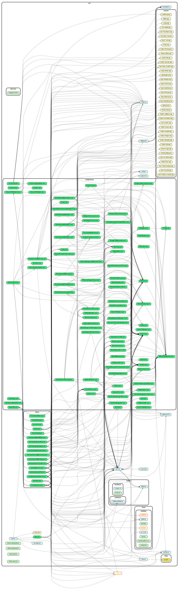

   <h1>
       
   </h1>

  <!-- Netlify Status -->
  

 

MyHbarWallet is a free, client-side interface helping you interact with Hedera™ Hashgraph. Our easy-to-use, open-source platform allows you to generate keys, create accounts, transfer hbars, and so much more.

## License

Copyright 2019 Hedera Hashgraph LLC

Licensed under the Apache License, Version 2.0 (the "License");
you may not use this file except in compliance with the License.
You may obtain a copy of the License at

<http://www.apache.org/licenses/LICENSE-2.0>

Unless required by applicable law or agreed to in writing, software
distributed under the License is distributed on an "AS IS" BASIS,
WITHOUT WARRANTIES OR CONDITIONS OF ANY KIND, either express or implied.
See the License for the specific language governing permissions and
limitations under the License.

## Contribution

Send us a Pull Request!

  
Source Dependency Graph

  </img>

